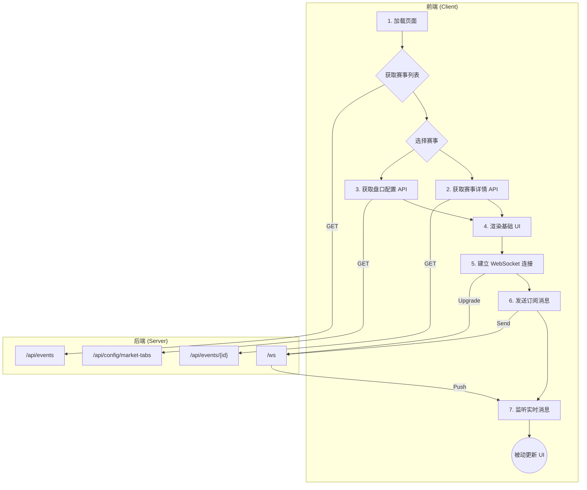

# Sportradar UOF 前端接口文档

**版本**: 2.1  
**作者**: Manus AI  
**最后更新**: 2024-12-02

## 1. 概述

本文档为 Sportradar UOF (Unified Odds Feed) 服务的前端开发者提供了完整的 REST API 和 WebSocket 接口说明。旨在帮助前端快速、准确地集成后端数据,实现高效的实时数据显示和交互。

### 1.1 架构概览

系统采用 **REST API + WebSocket** 的混合架构:

- **REST API**: 用于获取初始化数据,如赛事列表、赛事详情、盘口分组配置等。
- **WebSocket**: 用于实时接收赔率、盘口状态等增量更新数据。

### 1.2 数据交互流程



## 2. REST API 参考

所有 API 端点的根路径为 `/api`。

### 2.1 获取赛事列表

获取符合筛选条件的赛事列表,支持分页。

- **端点**: `GET /api/events`
- **方法**: `GET`

#### 2.1.1 查询参数

| 参数 | 类型 | 描述 | 示例 |
| :--- | :--- | :--- | :--- |
| `status` | string | 赛事状态: `live` (滚球), `prematch` (赛前), `ended` (已结束) | `live` |
| `sport_id` | integer | 体育项目 ID | `1` (足球) |
| `limit` | integer | 每页数量,默认 `20` | `50` |
| `offset` | integer | 偏移量,用于分页 | `100` |

#### 2.1.2 响应示例

```json
{
  "events": [
    {
      "id": "sr:match:12345",
      "sport_id": 1,
      "scheduled_at": "2024-12-02T14:00:00Z",
      "status": "live",
      "home_team": {
        "id": "sr:competitor:1",
        "name": "Team A"
      },
      "away_team": {
        "id": "sr:competitor:2",
        "name": "Team B"
      },
      "live_data": {
        "match_time": "65:30",
        "home_score": 1,
        "away_score": 0
      }
    }
  ],
  "total": 125
}
```

### 2.2 获取赛事详情

获取指定赛事的详细信息,包含该赛事下的所有盘口 (markets)。

- **端点**: `GET /api/events/{eventId}`
- **方法**: `GET`

#### 2.2.1 URL 参数

| 参数 | 类型 | 描述 | 示例 |
| :--- | :--- | :--- | :--- |
| `eventId` | string | 赛事唯一标识 (URN) | `sr:match:12345` |

#### 2.2.2 响应示例

```json
{
  "event": {
    "id": "sr:match:12345",
    // ... 其他赛事信息
    "markets": [
      {
        "id": 101,
        "name": "Match Odds",
        "status": "Active",
        "tabId": "regular_play", // 关键字段: 用于前端分组
        "specifiers": {},
        "outcomes": [
          {
            "id": "1",
            "name": "Team A",
            "odds": 1.85,
            "active": true
          },
          {
            "id": "2",
            "name": "Draw",
            "odds": 3.50,
            "active": true
          },
          {
            "id": "3",
            "name": "Team B",
            "odds": 4.20,
            "active": true
          }
        ]
      }
    ]
  }
}
```

### 2.3 获取盘口分组配置

获取所有盘口 Tab 和 Chip 的配置信息,用于前端动态生成筛选器。

- **端点**: `GET /api/config/market-tabs`
- **方法**: `GET`

#### 2.3.1 响应示例

```json
{
  "tabs": [
    {
      "id": "regular_play",
      "label": "常规玩法",
      "type": "group",
      "groups": ["regular_play"],
      "chipSpecifiers": [],
      "marketCount": 198,
      "primarySpecifier": null
    },
    {
      "id": "quarters",
      "label": "分节",
      "type": "specifier_aggregate",
      "groups": [],
      "chipSpecifiers": ["quarternr"],
      "marketCount": 22,
      "primarySpecifier": "quarternr"
    }
  ],
  "chips": {
    "quarters_quarternr_1": {
      "tabId": "quarters",
      "label": "第1节",
      "specifier": "quarternr",
      "value": "1"
    }
  }
}
```

## 3. WebSocket API 参考

WebSocket 用于接收实时的增量数据更新。

- **连接端点**: `ws://<your-domain>/ws`

### 3.1 订阅模型 (Client-to-Server)

连接成功后,客户端需要发送 `subscribe` 消息来订阅关心的数据。当用户切换赛事或修改购物车时,应重新发送订阅消息。

#### 3.1.1 订阅消息 (`subscribe`)

```json
{
  "action": "subscribe",
  "params": {
    "eventIds": ["sr:match:12345", "sr:match:67890"], // 当前页面展示的赛事 ID 列表
    "marketIds": [101, 102, 235], // 购物车中的盘口 ID 列表
    "messageTypes": ["odds_update", "market_status_change"] // 订阅的消息类型
  }
}
```

**参数说明**:
- `eventIds`: 订阅指定赛事的所有更新。
- `marketIds`: 订阅指定盘口的所有更新 (主要用于购物车)。
- `messageTypes`: 订阅的消息类型,建议全部订阅以保证数据完整性。

#### 3.1.2 取消订阅消息 (`unsubscribe`)

```json
{
  "action": "unsubscribe"
}
```

### 3.2 推送消息 (Server-to-Client)

服务器会根据客户端的订阅,推送相应的实时消息。

#### 3.2.1 赔率更新 (`odds_update`)

当赔率发生变化时推送。

```json
{
  "type": "odds_update",
  "eventId": "sr:match:12345",
  "marketId": 101,
  "timestamp": 1729666800000,
  "payload": {
    "market": {
      "id": 101,
      "status": "Active"
    },
    "outcomes": [
      {
        "id": "1",
        "odds": 1.90, // 赔率从 1.85 变为 1.90
        "active": true
      }
    ]
  }
}
```

#### 3.2.2 盘口状态变更 (`market_status_change`)

当盘口状态 (如: Active, Suspended, Deactivated) 发生变化时推送。

```json
{
  "type": "market_status_change",
  "eventId": "sr:match:12345",
  "marketId": 101,
  "timestamp": 1729667000000,
  "payload": {
    "id": 101,
    "status": "Suspended" // 盘口状态变为暂停
  }
}
```

#### 3.2.3 停止投注 (`bet_stop`)

当整个赛事或特定盘口组停止投注时推送。

```json
{
  "type": "bet_stop",
  "eventId": "sr:match:12345",
  "timestamp": 1729667200000,
  "payload": {
    "groups": "all", // "all" 或 "1|2|3"
    "marketStatus": "Deactivated" // 状态: Deactivated (停用) 或 Suspended (暂停)
  }
}
```

#### 3.2.4 比赛实况更新 (`live_data_update`)

当比赛实况数据 (如: 比分、时间) 发生变化时推送。

```json
{
  "type": "live_data_update",
  "eventId": "sr:match:12345",
  "timestamp": 1729667400000,
  "payload": {
    "match_time": "68:10",
    "home_score": 2, // 比分变为 2:0
    "away_score": 0
  }
}
```

## 4. 数据模型 (Data Models)

### 4.1 Event (赛事)

| 字段 | 类型 | 描述 |
| :--- | :--- | :--- |
| `id` | string | 赛事 URN | 
| `sport_id` | integer | 体育项目 ID |
| `scheduled_at` | string | 开赛时间 (ISO 8601) |
| `status` | string | `live`, `prematch`, `ended` |
| `home_team` | object | 主队信息 (Competitor) |
| `away_team` | object | 客队信息 (Competitor) |
| `live_data` | object | 滚球数据 |
| `markets` | array | 盘口列表 (仅在赛事详情 API 中) |

### 4.2 Market (盘口)

| 字段 | 类型 | 描述 |
| :--- | :--- | :--- |
| `id` | integer | 盘口 ID |
| `name` | string | 盘口名称 |
| `status` | string | `Active`, `Suspended`, `Deactivated`, `Settled` |
| `tabId` | string | **核心字段**: 用于前端分组的 Tab ID |
| `specifiers` | object | 盘口附加信息,如 `hcp`, `total` 等 |
| `outcomes` | array | 投注项列表 |

### 4.3 Outcome (投注项)

| 字段 | 类型 | 描述 |
| :--- | :--- | :--- |
| `id` | string | 投注项 ID |
| `name` | string | 投注项名称 |
| `odds` | float | 赔率 |
| `active` | boolean | 是否可投注 |

### 4.4 TabConfig (Tab 配置)

| 字段 | 类型 | 描述 |
| :--- | :--- | :--- |
| `id` | string | Tab 唯一标识 |
| `label` | string | Tab 显示名称 |
| `type` | string | `group` 或 `specifier_aggregate` |
| `groups` | array | 关联的 market group |
| `chipSpecifiers` | array | 关联的 Chip specifier 列表 |

### 4.5 ChipConfig (Chip 配置)

| 字段 | 类型 | 描述 |
| :--- | :--- | :--- |
| `tabId` | string | 所属的 Tab ID |
| `label` | string | Chip 显示名称 |
| `specifier` | string | 关联的 specifier |
| `value` | string | specifier 的值 |

## 5. 前端实现流程指南

1.  **获取赛事列表**: 调用 `GET /api/events` 获取赛事列表,并渲染。
2.  **获取盘口配置**: 在应用初始化时,调用 `GET /api/config/market-tabs` 获取并缓存盘口分组配置。
3.  **进入赛事详情**: 用户点击赛事后,调用 `GET /api/events/{eventId}` 获取赛事详情和所有盘口。
4.  **渲染盘口**: 
    - 根据返回的 `markets` 列表和缓存的盘口配置,动态生成 Tab 导航。
    - 当用户点击一个 Tab 时,根据该 Tab 的 `chipSpecifiers` 配置,从当前 Tab 下的 `markets` 中提取 `specifier` 的值,动态生成 Chip 筛选器。
    - 根据用户选择的 Tab 和 Chip,对全量 `markets` 列表进行本地筛选并展示。
5.  **建立 WebSocket 连接**: 建立 `/ws` 连接。
6.  **订阅数据**: 发送 `subscribe` 消息,订阅当前赛事 (`eventIds`) 和购物车中的盘口 (`marketIds`)。
7.  **实时更新**: 监听 WebSocket 消息,根据消息类型更新前端存储的 `markets` 列表。Vue/React 等响应式框架会自动更新视图。

## 6. 附录

### 6.1 赛事状态 (Event Status)

| 状态 | 描述 |
| :--- | :--- |
| `live` | 滚球中 |
| `prematch` | 即将开赛 |
| `ended` | 已结束 |
| `closed` | 已关闭 |
| `cancelled` | 已取消 |

### 6.2 盘口状态 (Market Status)

| 状态 | 描述 |
| :--- | :--- |
| `Active` | 可投注 |
| `Suspended` | 暂停投注 (临时) |
| `Deactivated` | 停用投注 (永久) |
| `Settled` | 已结算 |
| `Cancelled` | 已取消 |

### 6.3 Tab 类型 (Tab Type)

| 类型 | 描述 |
| :--- | :--- |
| `group` | 基于 market group 分组,如 "常规玩法"、"球员道具" |
| `specifier_aggregate` | 基于 specifier 聚合分组,如 "分节"、"分盘" |

---

**如有疑问,请随时与后端团队沟通。**

团队沟通。
