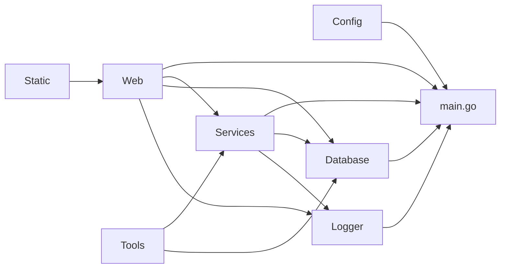
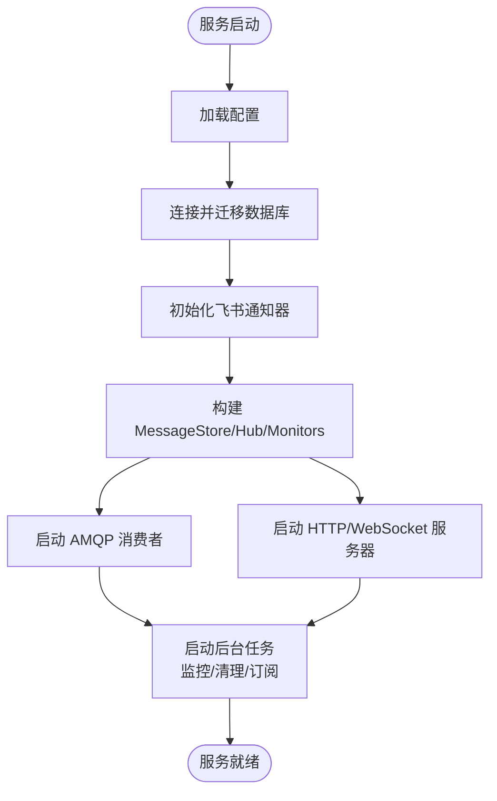
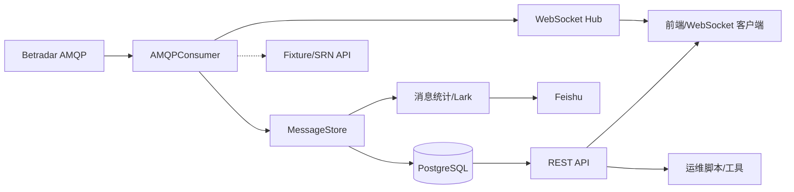
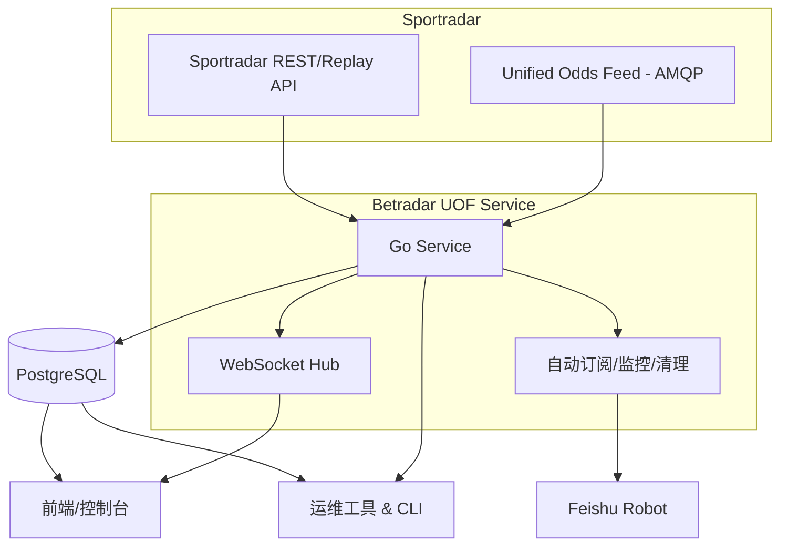

# Betradar UOF Service

## 项目概述
Betradar UOF Service 是一个用于接入 Sportradar Unified Odds Feed (UOF) 的 Go 服务，负责从 Betradar AMQP 消息总线实时消费赔率、结算、赛程等消息，持久化到 PostgreSQL，并通过 REST API、WebSocket 以及飞书机器人对外提供实时数据、监控与运维能力。系统同时内置自动订阅、赛程冷启动、数据清理、监控告警、重放调试等后台任务，支持在 Railway 或容器环境下快速部署。

## 技术栈
- Go 1.24（`gorilla/mux`、`gorilla/websocket`、`streadway/amqp`、`rs/cors` 等生态）
- PostgreSQL（原始消息、盘口/赔率、订阅状态、清理统计等持久化存储）
- RabbitMQ（Betradar AMQP 统一赔率消息源）
- Sportradar UOF REST API（订阅、赛程、重放、恢复等管理接口）
- Feishu/Lark Webhook（运行状态与告警通知）
- Railway/Docker（快速部署与环境配置）

## 项目结构
| 路径 | 说明 |
|------|------|
| `main.go` | 服务入口：加载配置、连接数据库、运行迁移、初始化通知器、启动 AMQP 消费者、HTTP 服务器和后台任务。 |
| `config/` | 读取环境变量生成统一配置（Betradar 凭证、队列路由、数据库、清理阈值、通知、Recover/Replay 参数等）。 |
| `database/` | 数据访问层：`database.go` 管理连接与迁移，`models.go` 定义主要数据结构，`migrations/` 存放 SQL 迁移脚本。 |
| `logger/` | stdout/stderr 分流 Logger，提供 `Println/Printf/Errorf/Fatalf` 封装。 |
| `services/` | 核心业务逻辑模块：AMQP 消费、消息存储、赔率解析、赛程解析、自动订阅、启动订阅、预赛处理、比赛监控、订阅同步、数据清理、重放客户端、恢复管理、飞书通知、SRN 映射等。 |
| `web/` | HTTP 层：`server.go` 注册路由，`*_handler.go` 提供 REST API，`websocket.go` 管理实时推送 Hub，`match_mapper.go` 提供前端展示映射。 |
| `cmd/migrate/` | 独立命令行工具，执行 `database/migrations` 中的 SQL 脚本。 |
| `tools/` | 诊断/调试 CLI 与脚本（数据库检查、消息回溯、重放测试、API 探测、快速订阅、飞书联调等）。 |
| `static/` | 简易静态前端（`index.html`、`uof-client.js`）用于浏览实时消息。 |
| `docs/` | 项目额外文档（部署指南、迁移指引、发布记录等）。 |
| 其他 | `Dockerfile*`、`railway.json`、`.sql` 脚本、`publish-to-github.sh` 等部署与运维辅助文件。 |

## 命令行接口（CLI）与API端点

### CLI 命令
| 命令 | 功能描述 | 参数 | 示例 |
|------|--------|------|------|
| `go run ./cmd/migrate` | 运行内置迁移，创建/更新核心数据库表结构。 | `环境变量: DATABASE_URL` | `DATABASE_URL=postgres://... go run ./cmd/migrate` |
| `go run ./tools/check_booked_matches.go` | 查询 AMQP Booked 比赛并输出订阅情况、队列连接状态。 | `环境变量: BETRADAR_ACCESS_TOKEN, UOF_*` | `go run ./tools/check_booked_matches.go` |
| `go run ./tools/test_match_list.go` | 连接 AMQP + REST，列出订阅列表并分析 bookable/booked 统计。 | `环境变量: BETRADAR_ACCESS_TOKEN` | `go run ./tools/test_match_list.go` |
| `go run ./tools/db_diagnostic.go` | 检查 Postgres 连接、模式权限、建表能力。 | `环境变量: DATABASE_URL` | `go run ./tools/db_diagnostic.go` |
| `go run ./tools/check_data.go` | 输出主要表行数、最近消息、Tracked events 等健康度。 | `环境变量: DATABASE_URL` | `go run ./tools/check_data.go` |
| `go run ./tools/examine_messages.go` | 抽样展示最近消息的类型、路由、原始 XML。 | `环境变量: DATABASE_URL` | `go run ./tools/examine_messages.go` |
| `go run ./tools/cleanup_database.go` | 删除 message_type 为空的历史消息并清理关联表。 | `环境变量: DATABASE_URL` | `go run ./tools/cleanup_database.go` |
| `go run ./tools/clear_database.go` | 危险操作：TRUNCATE 主要业务表并重置序列。 | `环境变量: DATABASE_URL` | `go run ./tools/clear_database.go` |
| `go run ./tools/verify_fix.go` | 验证消息类型修复效果与关键表数据量。 | `环境变量: DATABASE_URL` | `go run ./tools/verify_fix.go` |
| `go run ./tools/test_replay.go [-event] [-speed] ...` | 使用 Replay API 触发赛事重放并监控消息量。 | `环境变量: BETRADAR_ACCESS_TOKEN[, DATABASE_URL]`; `Flags: -event, -speed, -duration, -node, -stop` | `BETRADAR_ACCESS_TOKEN=... go run ./tools/test_replay.go -event sr:match:12345 -speed 20` |
| `go run ./tools/test_parsers.go` | 校验示例 XML 结构，辅助 Parser 联调。 | 无 | `go run ./tools/test_parsers.go` |
| `go run ./tools/test_parsing.go` | 对比旧/新 XML 解析逻辑，确保 message type 正确提取。 | 无 | `go run ./tools/test_parsing.go` |
| `go run ./tools/test_feishu.go` | 发送多种类型的飞书通知消息到指定 webhook。 | 代码内置 `webhookURL`（需替换） | `go run ./tools/test_feishu.go` |
| `tools/get_replayable_events.sh` | 查询数据库中过去 48 小时前的赛事以供 Replay 使用。 | `环境变量: DATABASE_URL` | `DATABASE_URL=... ./tools/get_replayable_events.sh` |
| `tools/quick_replay_test.sh [event] [speed] [duration]` | 快速拉起 Replay，用于端到端练习。 | `环境变量: UOF_USERNAME, UOF_PASSWORD[, DATABASE_URL]` | `./tools/quick_replay_test.sh test:match:21797788 20 45` |
| `tools/replay_event.sh <event_id> [speed] [duration] [node]` | 直接调用 Betradar Replay REST 接口完成重放生命周期。 | `环境变量: UOF_USERNAME, UOF_PASSWORD` | `./tools/replay_event.sh sr:match:12345 10 60 1` |
| `tools/test_api.sh [base_url]` | 连续调用服务 API，验证部署可用性。 | 可选参数 `base_url` | `./tools/test_api.sh https://demo.example.com` |
| `tools/test_ld_connection.sh` | 旧版 LD 诊断脚本（依赖已移除的 `/api/ld/*`，仅供参考）。 | `环境变量: SERVER_URL` | `SERVER_URL=http://localhost:8080 ./tools/test_ld_connection.sh` |
| `tools/test_replay_api.sh [service_url]` | 远程验证 Replay API 端点是否上线并可用。 | 默认 Railway 地址，可覆盖 | `./tools/test_replay_api.sh https://your-app.up.railway.app` |
| `publish-to-github.sh <github-username>` | 初始化 Git 仓库并推送至 GitHub。 | Git/gh CLI 必须已安装 | `./publish-to-github.sh yourname` |

### API 接口

#### 运行状态与诊断
- **GET /api/health** – 健康检查，返回 `status`、`time`。
- **GET /api/stats** – 聚合统计（消息总数、事件数、赔率/投注消息计数）。
- **GET /api/ip** – 查询本服务外网 IP，辅助 Sportradar 白名单配置。
- **GET /ws** – WebSocket 连接端点，支持客户端发送 `{type:"subscribe", message_types:[...], event_ids:[...]}` 进行消息过滤，实时接收 `message`、`connected` 等推送。

#### 消息与赛事查询
- **GET /api/messages** – 分页查询原始消息。 参数：`limit`(≤100，默认50)、`offset`、`event_id`、`message_type`。 响应：消息数组（含 XML、路由键、时间戳等）。
- **GET /api/events** – 增强版赛事列表，包含盘口和赔率。 参数：`status`、`subscribed`(true/false)、`sport_id`、`search`、`producer`(盘口生产者)、`is_live`、`is_ended`、`has_markets`、`limit`（默认100）。
- **GET /api/events/simple** – 活跃 `tracked_events` 精简列表。
- **GET /api/events/{event_id}/messages** – 返回指定赛事的全部消息。
- **GET /api/match/records?event_id=...** – 汇总比赛的消息、赔率变化、投注停止/结算、盘口等概览。
- **GET /api/record/detail?type=...&id=...** – 获取单条记录原始数据（支持 message/odds_change/bet_stop/bet_settlement/market）。

#### 赔率与盘口
- **GET /api/odds/all** – 当前订阅赛事的盘口与赔率快照（最多100场）。
- **GET /api/odds/{event_id}/markets** – 指定赛事的盘口列表。
- **GET /api/odds/{event_id}/{market_id}** – 指定盘口的当前赔率数组。
- **GET /api/odds/{event_id}/{market_id}/{outcome_id}/history** – 赔率历史，`limit` 默认 50，最大 200。

#### 赛事检索与前端专用接口
- **GET /api/matches/live** – 进行中的比赛列表。
- **GET /api/matches/upcoming?hours=24** – 未来 `hours` 小时内将开赛的比赛。
- **GET /api/matches/status?status=active** – 按内部 `tracked_events.status` 过滤。
- **GET /api/matches/search?q=keyword** – 通过队名 / event_id 模糊检索。
- **GET /api/matches/{event_id}** – 单场比赛详情（含 SR 映射信息）。
- **GET /api/prematch/events** – 数据库中未开赛的预订赛事。
- **GET /api/prematch/stats** – Pre-match 统计数据（总数、已订阅、存在赔率的数量）。

#### 自动订阅与监控
- **POST /api/booking/auto** – 异步触发 `AutoBookingService`，订阅所有 bookable 比赛并发送飞书报告。
- **POST /api/booking/match/{match_id}** – 异步订阅单场比赛。
- **POST /api/booking/trigger** – 运行启动/重复订阅逻辑（`StartupBookingService`），清理已结束赛事并重新订阅 live 场次。
- **GET /api/booking/booked** – 调用 Betradar API 返回已订阅的赛事列表。
- **GET /api/booking/bookable** – 当前可订阅赛事列表及统计。
- **POST /api/booking/sync** – 对比 Betradar API 与本地 `tracked_events`，同步 `subscribed` 状态。
- **POST /api/prematch/trigger** – 触发 Pre-match 订阅流程，并在成功时推送飞书通知。
- **POST /api/monitor/trigger** – 立即执行比赛监控（`MatchMonitor`）并通过飞书输出报告。
- **GET /api/producer/status** – 当前 Producer 心跳状态、最近 alive 时间等。
- **GET /api/producer/bet-acceptance** – 判断是否可以继续接受投注（全部 Producer 健康时返回 true）。

#### 恢复与重放
- **POST /api/recovery/trigger** – 手动触发配置的产品（liveodds/pre）全量恢复；采用异步执行并更新 `recovery_status`。
- **POST /api/recovery/event/{event_id}?product=liveodds** – 针对单场赛事触发赔率恢复和 stateful 消息恢复。
- **GET /api/recovery/status?limit=20** – 恢复请求历史（状态、时间戳、节点 ID 等）。
- **POST /api/replay/start** – 启动 Replay 测试。Body: `{event_id (必填), speed?, duration?, node_id?, max_delay?, use_replay_timestamp?}`。成功后异步执行 QuickReplay，并可按 `duration` 自动停止。
- **POST /api/replay/stop** – 停止当前 Replay。
- **GET /api/replay/status** – 返回 Replay 状态（XML）。
- **GET /api/replay/list** – 返回 Replay 列表（XML）。

#### 数据维护
- **GET /api/cleanup/stats** – 统计主要表行数/大小，基于当前保留策略。
- **POST /api/cleanup/manual** – 手动触发一次数据清理（根据配置的保留天数逐表执行）。
- **POST /api/database/reset?confirm=yes** – 全量删除业务数据并重置序列，成功后发送飞书通知。

> 除特别说明外，所有 POST 接口接受 JSON 请求体并返回 JSON 响应；TLS/鉴权由部署环境（如 Railway）统一承担。

## 核心业务逻辑
- **启动流程**：加载配置 → 连接/迁移 PostgreSQL → 初始化飞书通知 → 创建消息存储、Producer 监控、WebSocket Hub、消息统计器 → 启动 AMQP 消费者和 HTTP 服务器。
- **实时消费**：`AMQPConsumer` 通过 Betradar AMQP 获取 `alive/odds_change/bet_stop/bet_settlement/fixture_change/...` 消息；落库 `uof_messages` 并细分保存到 `odds_changes/bet_stops/bet_settlements/markets/odds`，同时广播 WebSocket 和更新统计。
- **数据富化**：Odds/Fiture 解析器自动补充队伍信息、比分、盘口、SRN 映射；缺失信息时后台调用 Fixture API 或 SRN Mapping API 并写入 `tracked_events`。
- **通知与监控**：消息统计器、ProducerMonitor、MatchMonitor、SubscriptionCleanup、DataCleanup 等定时任务定期运行并通过飞书推送健康报告/告警。
- **自动订阅**：冷启动完成后启动 `StartupBookingService` 与 `AutoBookingService`、`PrematchService`，对 live 与 pre-match 赛事进行订阅、验证与报表。
- **数据清理**：`DataCleanupService` 根据保留策略每日 02:00 清理历史消息、盘口、赔率、LiveData 等表并汇总飞书通知。
- **运维工具**：REST API 提供重放、恢复、订阅同步、数据库重置、赔率/记录检索等操作，CLI `tools/` 辅助问题排查。

## 关键模块说明
- **config.Config** – 统一封装服务参数，支持路由键、恢复策略、清理阈值、飞书 Webhook、The Sports 凭证等配置；默认值覆盖常见场景。
- **database** – 封装连接池、表结构迁移与数据模型，提供基本 DAO 操作（增删改查、索引补全、恢复状态更新）。
- **services.AMQPConsumer** – 核心消费引擎，负责连接 Betradar AMQP、解析 XML、持久化、补齐赛事信息、驱动 WebSocket/统计/通知等。
- **services.MessageStore** – 对 `uof_messages`、`tracked_events` 及衍生表的读写封装，提供查询/统计/恢复状态接口。
- **services.FixtureParser / OddsParser / OddsChangeParser** – 可插拔 XML 解析器，将原始消息转换为结构化数据并更新数据库。
- **services.AutoBooking / StartupBooking / Prematch** – 结合 Betradar REST API 实现自动订阅、启动重新订阅与预赛订阅流程。
- **services.MatchMonitor / ProducerMonitor / MessageStatsTracker** – 负责赛事订阅健康度、Producer 心跳、消息量监控，并触发飞书告警。
- **services.RecoveryManager / ReplayClient** – 封装 UOF 恢复与 Replay API 调用，带节流控制与失败重试。
- **services.SubscriptionCleanup / SyncService / DataCleanupService** – 定时清理已结束订阅、同步订阅状态、按保留期清理历史数据。
- **web.Server** – Gorilla Mux HTTP 服务器，集中注册 REST & WebSocket 路由，并为 handler 注入 `MessageStore`、`ReplayClient`、`AutoBooking`、`ProducerMonitor` 等依赖。
- **websocket.Hub** – 广播中心，支持按消息类型 / 赛事过滤的订阅和实时推送。
- **tools/** – 覆盖数据库诊断、消息检查、重放、API 验证、飞书联调、GitHub 发布等场景的 CLI 工具集。

## 数据流
1. **消息输入**：Betradar AMQP 向 `AMQPConsumer` 推送 XML 消息；若队伍/盘口信息缺失，异步调用 Fixture/SRN/Markets API 补全。
2. **落库与缓存**：`MessageStore` 将原始 XML 入表并派生数据写入 `tracked_events`、`odds_changes`、`markets`、`odds`、`recovery_status` 等；Producer alive 更新 `producer_status`。
3. **实时分发**：消费结果通过 WebSocket Hub 广播给订阅者；消息统计器累积数据并按周期发送飞书报告。
4. **后台任务**：MatchMonitor、SubscriptionCleanup、DataCleanup、ColdStart、Startup/Prematch Booking 等在独立 goroutine 中执行，保证订阅覆盖与数据体量稳定。
5. **对外服务**：HTTP 层基于数据库提供 REST API；运维/重放/恢复操作通过服务触发相应的 `services.*` 模块，与 Betradar REST API 交互；必要事件通过飞书 Webhook 通知运维团队。

## 扩展性设计
- **模块解耦**：配置、数据库、服务、HTTP 层通过接口解耦，易于替换（如迁移到其他消息总线或通知渠道）。
- **可插拔解析器**：Odds/Fixture/SRN 解析器集中在 `services/`，可以按需拓展新的 XML 类型或缓存策略。
- **后台协程隔离**：各定时任务独立 goroutine + ticker，互不阻塞，便于按需扩展或关闭。
- **配置化保留策略**：数据清理、恢复时段、订阅间隔等均通过环境变量控制，适应不同业务规模。
- **调试工具齐备**：Replay、恢复、数据库诊断 CLI/script 覆盖端到端调试，使问题定位与回放验证更快。

## 架构图

### 模块依赖图

### 业务流程图

### 数据流图

### 系统架构图

