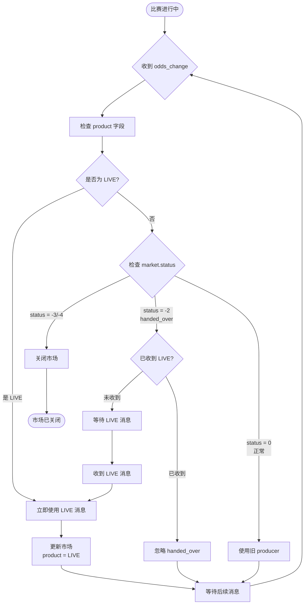

# SportRadar 产品接入指南

**版本**: 1.0.x  
**目标**: 理解 SportRadar 产品的关键业务规则和接入顺序  
**适用对象**: 开发人员

---

## 📋 目录

1. [产品概述](#产品概述)
2. [接入准备](#接入准备)
3. [UOF 接入关键规则](#uof-接入关键规则)
4. [Live Data 接入关键规则](#live-data-接入关键规则)
5. [Producer 交接机制](#producer-交接机制)
6. [数据恢复规则](#数据恢复规则)
7. [常见陷阱](#常见陷阱)

---

## 产品概述

### UOF (Unified Odds Feed)
**用途**: 实时赔率数据  
**协议**: AMQP (RabbitMQ)  
**核心概念**:
- **Producer**: 数据生产者,不同 Producer 负责不同阶段
  - `Pre-match Odds (ID: 3)`: 赛前赔率
  - `Live Odds (ID: 1)`: 比赛进行中的赔率
  - `Ctrl (ID: 3)`: 控制和管理
- **Market**: 投注市场 (如 1X2, Over/Under)
- **Outcome**: 市场中的投注选项

### Live Data (LD)
**用途**: 实时比赛事件数据  
**协议**: Socket (SSL, Port 2017)  
**核心概念**:
- **Match**: 比赛
- **Event**: 比赛事件 (进球、红牌等)
- **Sequence Number**: 消息序列号,**必须连续**

### 产品组合

```
UOF (赔率) + Live Data (事件) = 完整数据
```

---

## 接入准备

### 1. 获取凭证

联系 SportRadar 获取:
- UOF Username + Password
- Live Data Username + Password
- Bookmaker ID
- 确认开通的 Producer 权限

### 2. IP 白名单

**Live Data 必须配置 IP 白名单**:
1. 获取服务器出口 IP
2. 提供给 SportRadar 技术支持
3. 等待确认 (1-2 工作日)

**UOF 不需要 IP 白名单**

### 3. 了解环境

- **Integration (集成)**: 测试环境
  - UOF: `stgmq.betradar.com:5671`
  - Live Data: 使用生产服务器 (无单独集成环境)
  
- **Production (生产)**: 正式环境
  - UOF: `mq.betradar.com:5671`
  - Live Data: `livedata.betradar.com:2017`

---

## UOF 接入关键规则

### 规则 1: 首次连接必须做数据恢复

**为什么?**
- 首次连接时,队列是空的
- 不会自动接收历史数据
- 必须主动请求恢复

**恢复流程**:
```
1. 连接 AMQP
2. 立即调用 Recovery API
3. 等待接收 snapshot_complete 消息
4. 开始正常消费
```

**关键消息**: `snapshot_complete`
```xml
<snapshot_complete product="3" request_id="123" timestamp="1234567890" />
```

收到此消息表示恢复完成,可以开始正常处理赔率数据。

**重要**: 
- ⚠️ 恢复只返回**当前最新赔率**,不包含历史变化
- ⚠️ 历史赔率数据需要从 **Ctrl 后台下载**

### 规则 2: 必须订阅比赛才能收到赔率

**默认行为**: 连接后不会收到任何赔率数据

**订阅流程**:
```
1. 查询 live 比赛列表 (Schedule API)
2. 筛选 bookable=true 的比赛
3. 调用 Booking API 订阅
4. 开始接收 odds_change 消息
```

**订阅时机**:
- 比赛开始前 1-2 小时
- 比赛进行中随时可订阅
- 订阅后立即生效

### 规则 3: Producer 有不同的职责

| Producer ID | 名称 | 职责 | 何时活跃 |
| :--- | :--- | :--- | :--- |
| 1 | Live Odds | 实时赔率 | 比赛进行中 |
| 3 | Pre-match Odds / Ctrl | 赛前赔率 + 控制 | 比赛前 + 全程 |
| 5 | Premium Cricket | 板球专用 | 板球比赛 |

**关键**: 同一个比赛可能同时有多个 Producer 发送消息

### 规则 4: 消息中的关键字段

**每条 odds_change 消息包含**:
- `product`: Producer ID (1, 3, 5...)
- `event_id`: 比赛 ID (如 `sr:match:12345678`)
- `timestamp`: 消息时间戳
- `markets`: 市场和赔率数据
  - `market.id`: 市场 ID
  - `market.status`: 市场状态
  - `outcome`: 投注选项和赔率

**市场状态**:
- `0`: 正常活跃
- `-1`: 暂停
- `-2`: **handed_over** (已交接给新 Producer)
- `-3`: 结算
- `-4`: 取消

---

## Producer 交接机制

### 什么是交接?

当比赛从赛前进入 live 状态时,赔率数据的责任从 **Pre-match Producer (3)** 转移到 **Live Producer (1)**。

### 交接流程



### 关键规则

#### 规则 A: LIVE 消息优先级最高

一旦收到 `product=1` (Live Odds) 的消息,**立即使用**,忽略其他 Producer 的消息。

#### 规则 B: handed_over 的处理

收到 `status=-2` (handed_over) 时:

**情况 1**: 已经收到 LIVE 消息
```
→ 忽略此 handed_over 消息
→ 继续使用 LIVE 数据
```

**情况 2**: 还未收到 LIVE 消息
```
→ 暂停更新此市场
→ 等待 LIVE producer 发送同 market_id 的消息
→ 收到后开始使用 LIVE 数据
```

#### 规则 C: 可能存在时序问题

⚠️ **重要**: LIVE 消息可能比 handed_over 消息**更早**到达!

**原因**:
- 不同 Producer 的消息通过不同的队列
- 网络延迟不同
- 处理速度不同

**正确处理**:
```
if (message.product == 1) {  // LIVE
    // 直接使用,不管之前是什么状态
    updateMarket(message);
    markAsLive(market_id);
} else if (message.status == -2) {  // handed_over
    if (isAlreadyLive(market_id)) {
        // 已经在用 LIVE 了,忽略
        ignore(message);
    } else {
        // 等待 LIVE
        waitForLive(market_id);
    }
}
```

### 实际案例

**时间线**:
```
10:00:00 - 比赛开始
10:00:01 - 收到 LIVE (product=1) 的 odds_change
10:00:03 - 收到 Pre-match (product=3) 的 handed_over (status=-2)
```

**正确处理**:
1. 10:00:01 收到 LIVE → 立即使用,标记市场为 LIVE
2. 10:00:03 收到 handed_over → 检查发现已经是 LIVE,忽略

**错误处理**:
1. 10:00:01 收到 LIVE → 使用
2. 10:00:03 收到 handed_over → 错误地暂停市场,等待 LIVE (实际已经收到了!)

---

## 数据恢复规则

### 恢复类型

#### 1. 全量恢复 (Full Recovery)

**何时使用**:
- 首次连接
- 长时间断线 (>3小时)
- 数据库清空后重启

**API**:
```
POST /v1/{product}/recovery/initiate_request?after={timestamp}&request_id={producer_id}
```

**参数**:
- `after`: Unix 时间戳 (毫秒),恢复此时间点之后的数据
- `request_id`: Producer ID

**返回数据**:
- 所有活跃比赛的当前赔率
- 不包含历史变化记录
- 以 `snapshot_complete` 消息结束

#### 2. 事件恢复 (Event Recovery)

**何时使用**:
- 特定比赛数据丢失
- 怀疑某场比赛数据不完整

**API**:
```
POST /v1/{product}/odds/events/{event_id}/initiate_request
```

**返回数据**:
- 该比赛的当前赔率
- 立即返回,不等待 snapshot_complete

### 恢复窗口

**重要限制** (按 Producer 类型): 
- **Live Odds producers**: 10 小时
- **Gaming producers**: 3 小时
- **Premium Cricket**: 最少 7 天
- **其他 producers**: 72 小时

超过恢复窗口的数据无法通过 Recovery API 获取。

### 历史数据获取

**Recovery API 的局限**:
- ❌ 不提供历史赔率变化
- ❌ 不提供已结束比赛的数据
- ✅ 只提供当前活跃比赛的最新赔率

**获取历史数据**:
1. 登录 **Ctrl 后台** (https://ctrl.betradar.com)
2. 导航到数据下载页面
3. 选择日期范围和数据类型
4. 下载 CSV/XML 文件
5. 导入到数据库

**Ctrl 后台提供**:
- 历史赔率变化记录
- 已结束比赛的完整数据
- 结算结果
- 统计数据

---

## Live Data 接入关键规则

### 规则 1: 序列号必须连续

**每条消息包含 sequence_number**:
```xml
<event sequence="12345" ...>
```

**检查逻辑**:
```
if (current_seq != last_seq + 1) {
    // 检测到间隙!
    gap = current_seq - last_seq - 1;
    log.error("Missing {} messages", gap);
    // 触发告警
}
```

**如果检测到间隙**:
1. 记录日志和告警
2. 继续处理后续消息 (不阻塞)
3. 联系 SportRadar 确认是否需要补数据

### 规则 2: 订阅后才接收数据

**默认行为**: 连接后不会收到任何数据

**订阅消息**:
```xml
<match matchid="944423"/>
```

**取消订阅**:
```xml
<unmatch matchid="944423"/>
```

**建议**: 订阅 UOF 中已订阅的比赛,保持一致性

### 规则 3: 数据源标识

**Live Data 有多个数据源**:
- **BC** (Betradar Collect): 自动采集
- **DC** (Data Centre): 人工采集
- **iScout**: 移动采集

**消息中的标识**:
```xml
<event source="BC" ...>
```

**质量排序**: DC > iScout > BC

### 规则 4: 与 UOF 的关联

**关键字段**: `match_id`

- UOF: `event_id="sr:match:12345678"`
- Live Data: `matchid="944423"` (不带前缀)

**关联方法**:
```
UOF event_id: sr:match:12345678
提取数字部分: 12345678
Live Data matchid: 需要去掉 "sr:match:" 前缀

或者通过 API 查询比赛信息获取对应关系
```

---

## 常见陷阱

### 陷阱 1: 忘记做首次恢复

**现象**: 连接成功,但收不到任何消息

**原因**: 队列是空的,没有触发恢复

**解决**: 连接后立即调用 Recovery API

### 陷阱 2: 没有订阅比赛

**现象**: 连接正常,恢复完成,但没有 odds_change

**原因**: 没有订阅任何比赛

**解决**: 调用 Booking API 订阅比赛

### 陷阱 3: 错误处理 handed_over

**现象**: 比赛开始后赔率停止更新

**原因**: 收到 handed_over 后暂停了市场,但 LIVE 消息已经先到了

**解决**: 检查是否已经收到 LIVE 消息,如果是则忽略 handed_over

### 陷阱 4: 忽略序列号检查

**现象**: 数据看起来正常,但偶尔丢失关键事件

**原因**: 没有检查序列号连续性,丢失了消息但不知道

**解决**: 实现序列号连续性检查和告警

### 陷阱 5: 混淆环境

**现象**: 连接失败或收到错误数据

**原因**: 使用了错误环境的凭证或服务器地址

**解决**: 
- Integration 凭证 → stgmq.betradar.com
- Production 凭证 → mq.betradar.com
- Live Data 只有一个环境

### 陷阱 6: 期望 Recovery 返回历史数据

**现象**: 恢复后发现只有当前赔率,没有历史变化

**原因**: Recovery API 只返回最新状态

**解决**: 历史数据从 Ctrl 后台下载

---

## 接入检查清单

### UOF 接入

- [ ] 获取凭证并确认 Producer 权限
- [ ] 配置 AMQP 连接 (正确的环境)
- [ ] 实现首次连接自动恢复
- [ ] 实现 snapshot_complete 处理
- [ ] 实现比赛订阅 (Booking API)
- [ ] 实现 Producer 交接逻辑
- [ ] 处理 handed_over 时序问题
- [ ] 实现市场状态管理
- [ ] 配置监控和告警

### Live Data 接入

- [ ] 获取凭证
- [ ] 配置服务器 IP 白名单
- [ ] 实现 Socket 连接
- [ ] 实现登录流程
- [ ] 实现比赛订阅
- [ ] 实现序列号连续性检查
- [ ] 实现数据源识别
- [ ] 实现与 UOF 的数据关联
- [ ] 配置监控和告警

### 数据管理

- [ ] 设计数据库表结构
- [ ] 实现 UOF ↔ LD 关联
- [ ] 实现历史数据归档策略
- [ ] 配置 Ctrl 后台访问
- [ ] 制定数据备份策略

---

## 技术支持

**SportRadar**:
- 技术支持: support@sportradar.com
- 文档: https://docs.sportradar.com
- Ctrl 后台: https://ctrl.betradar.com

**本项目**:
- GitHub: https://github.com/extra-time-zone/betradar-uof-service
- 版本: 1.0.x

---

**最后更新**: 2025-10-22  
**维护者**: 项目开发团队

